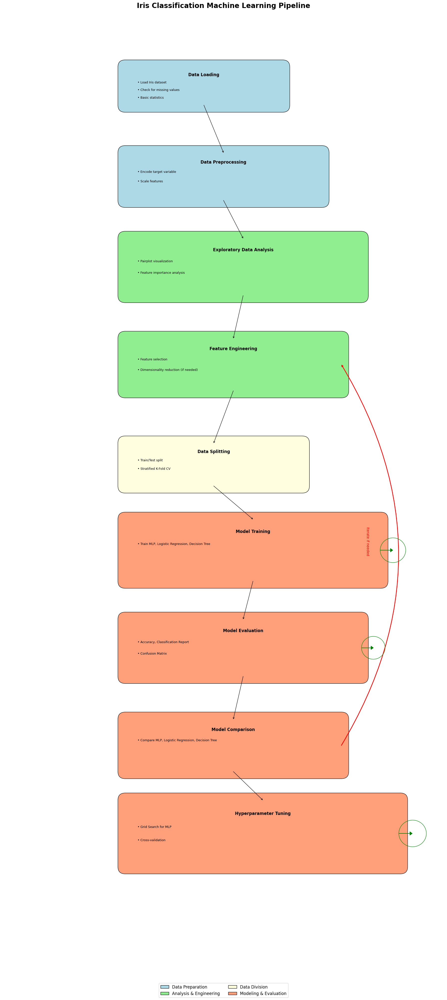

Iris Species Classification

# Project Description

This project implements a Machine Learning pipeline for classifying Iris flowers into three species using sepal and petal measurements. The system is deployed on a cloud platform and includes features for model training, evaluation, and prediction.

## Table of Contents

- Project Description
- Features
- Pipeline Visualization
- Project Structure
- Setup Instructions
- Model Training and Evaluation
- Deployment
- Making Predictions
- Retraining the Model
- Monitoring and Evaluation in Production
- Model Performance
- Future Improvements
- License

## Project Description

The Iris Species Classification project utilizes a Multi-layer Perceptron (MLP) classifier to categorize Iris flowers based on their sepal and petal measurements. The model is trained offline, saved as a pickle file, and deployed on a cloud platform for scalable predictions. This project includes extensive preprocessing, hyperparameter tuning, and a robust evaluation process to ensure high accuracy.

## Features

- Data Preprocessing and Feature Engineering: Handling missing values, feature scaling, and label encoding.
- Model Training Using MLP Classifier: Training the model with a Multi-layer Perceptron classifier.
- Model Evaluation with Various Metrics: Using classification reports, confusion matrices, and accuracy scores.
- Cloud Deployment for Scalable Predictions: Deploying the model on a cloud platform for real-time predictions.
- UI for Visualizing the ML Pipeline Process: Providing a user interface to visualize the entire ML pipeline.
- Ability to Retrain the Model with New Data: Facilitating model retraining with new incoming data.
- Real-time Predictions through API Endpoints: Enabling real-time predictions using API calls.

## Pipeline Visualization

Detailed steps and visualizations can be found in the `notebooks/Iris.ipynb` file.



## Project Structure

```
iris-species-classification/
├── data/
│   └── Iris.csv
├── img/
│   └── download.png
├── models/
│   └── best_mlp_model.pkl
├── notebook/
│   └── Iris.ipynb
├── src/
│   ├── model.py
│   ├── prediction.py
│   ├── preprocessing.py
│   └── main.py
├── README.md
└── requirements.txt
```

## Setup Instructions

Clone the Repository:

```bash
git clone https://github.com/thedavidemmanuel/iris-species-classification.git
cd iris-species-classification
```

Create a Virtual Environment and Activate It:

```bash
python -m venv env
source env/bin/activate # On Windows, use env\Scripts\activate
```

Install the Required Packages:

```bash
pip install -r requirements.txt
```

Run the Jupyter Notebook for Data Analysis and Model Training:

```bash
jupyter notebook notebooks/Iris.ipynb
```

## Model Training and Evaluation

The `notebooks/Iris.ipynb` file contains detailed steps for:

- Data Loading and Exploration: Understanding the dataset and its characteristics.
- Preprocessing and Feature Engineering: Handling missing values, feature scaling, and selection.
- Model Creation and Training: Building and training the MLP classifier.
- Evaluation Using Various Metrics: Assessing model performance using accuracy, precision, recall, and F1-score.
- Hyperparameter Tuning: Fine-tuning the model parameters for optimal performance.
- Model Comparison: Comparing the MLP classifier with other models like Logistic Regression and Decision Tree.

## Deployment

The model is deployed on Render. You can access the API documentation and test the model at:
[https://iris-species-classification-1.onrender.com/docs#/default/predict_predict_post](https://iris-species-classification-1.onrender.com/docs#/default/predict_predict_post)

The model is also deployed on vercel as a web app. You can access the web app and interact with the UI at: [https://iris-species-classification-5e23.vercel.app/](https://iris-species-classification-5e23.vercel.app/)

## Making Predictions

To make a prediction, send a POST request to the `/predict` endpoint with the following JSON payload:

```json
{
  "sepal_length": 5.1,
  "sepal_width": 3.5,
  "petal_length": 1.4,
  "petal_width": 0.2
}
```

The API will return the predicted Iris species.

## Retraining the Model

The model can be retrained when new data becomes available. To trigger retraining:

1. Add new data to the `data/` directory.
2. Run the retraining script:

```bash
python src/model.py --retrain
```

## Monitoring and Evaluation in Production

The deployed model's performance is continuously monitored. You can view metrics such as:

- Prediction Accuracy
- Response Times
- Number of Requests
  Access these metrics through the monitoring dashboard (provide link if available).

## Model Performance

The best MLP model achieved an accuracy of 96.7% on the test set. Detailed evaluation metrics and visualizations can be found in the notebook.

## Future Improvements

- Implement A/B Testing for Model Versions: To compare different versions of the model in production.
- Add More Advanced Feature Engineering Techniques: To enhance model performance.
- Explore Ensemble Methods: For potentially higher accuracy.

## License

This project is licensed under the MIT License. See the `LICENSE` file for details.
