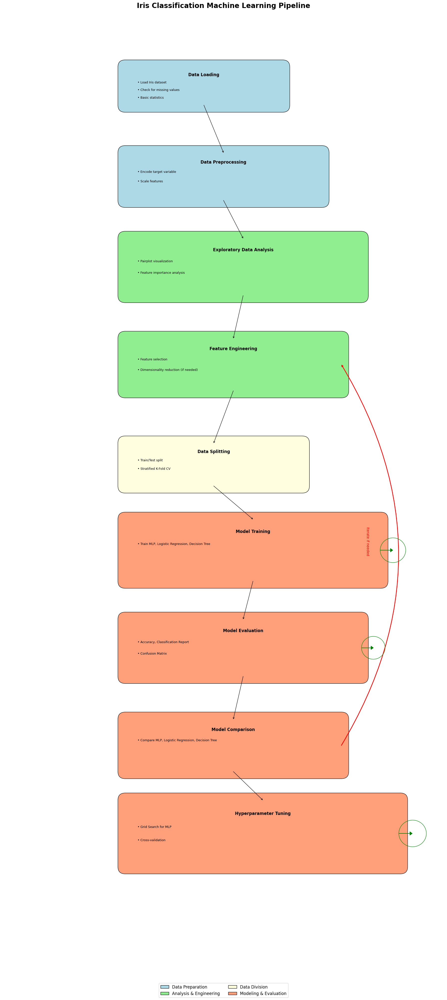

# Iris Species Classification

This project implements a Machine Learning pipeline for classifying Iris flowers into three species using sepal and petal measurements. The system is deployed on a cloud platform and includes features for model training, evaluation, and prediction.

## Project Description

The Iris Species Classification project utilizes a Multi-layer Perceptron (MLP) classifier to categorize Iris flowers based on their sepal and petal measurements. The model is trained offline, saved as a pickle file, and deployed on a cloud platform for scalable predictions.

## Features

- Data preprocessing and feature engineering
- Model training using MLP classifier
- Model evaluation with various metrics
- Cloud deployment for scalable predictions
- UI for visualizing the ML pipeline process
- Ability to retrain the model with new data
- Real-time predictions through API endpoints



## Project Structure

```
iris-species-classification/
│
├── data/
│   └── Iris.csv
│
├── notebooks/
│   └── iris_classification.ipynb
│
├── src/
│   ├── data_preprocessing.py
│   ├── model.py
│   └── evaluation.py
│
├── models/
│   └── iris_model.pkl
│
├── requirements.txt
│
└── README.md
```

## Setup Instructions

1. Clone the repository:

```
git clone https://github.com/yourusername/iris-species-classification.git
cd iris-species-classification
```

2. Create a virtual environment and activate it:

```
python -m venv env
source env/bin/activate  # On Windows, use env\Scripts\activate
```

3. Install the required packages:

```
pip install -r requirements.txt
```

4. Run the Jupyter notebook for data analysis and model training:

```
jupyter notebook notebooks/iris_classification.ipynb
```

## Model Training and Evaluation

The `notebooks/iris_classification.ipynb` file contains detailed steps for:

- Data loading and exploration
- Preprocessing and feature engineering
- Model creation and training
- Evaluation using various metrics (accuracy, precision, recall, F1-score)
- Hyperparameter tuning
- Model comparison (MLP, Logistic Regression, Decision Tree)

## Deployment

The model is deployed on Render. You can access the API documentation and test the model at:

[https://iris-species-classification-1.onrender.com/docs#/default/predict_predict_post](https://iris-species-classification-1.onrender.com/docs#/default/predict_predict_post)

### Making Predictions

To make a prediction, send a POST request to the `/predict` endpoint with the following JSON payload:

```json
{
  "sepal_length": 5.1,
  "sepal_width": 3.5,
  "petal_length": 1.4,
  "petal_width": 0.2
}
```

The API will return the predicted Iris species.

## Retraining the Model

The model can be retrained when new data becomes available. To trigger retraining:

1. Add new data to the `data/train/` directory.
2. Run the retraining script:

```
python src/model.py --retrain
```

## Monitoring and Evaluation in Production

The deployed model's performance is continuously monitored. You can view metrics such as:

- Prediction accuracy
- Response times
- Number of requests

Access these metrics through the monitoring dashboard (provide link if available).

## Future Improvements

- Implement A/B testing for model versions
- Add more advanced feature engineering techniques
- Explore ensemble methods for potentially higher accuracy

## License

This project is licensed under the MIT License - see the LICENSE file for details.
